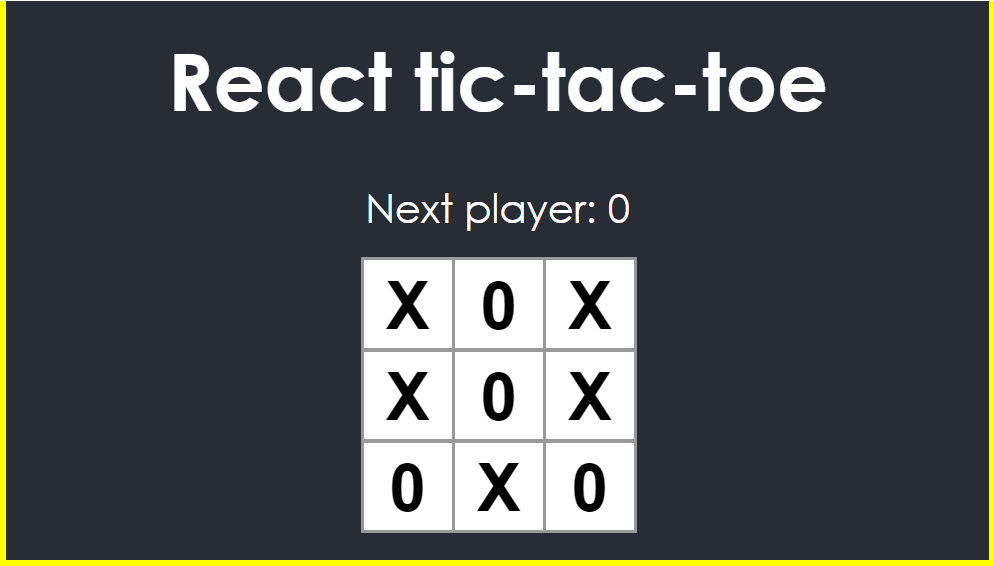
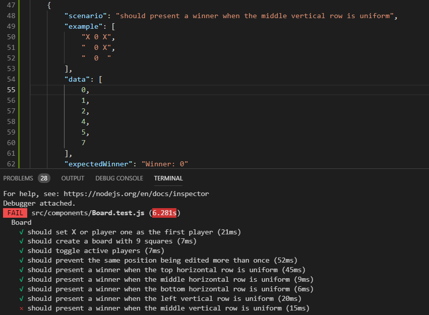
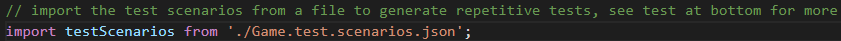
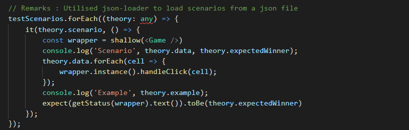
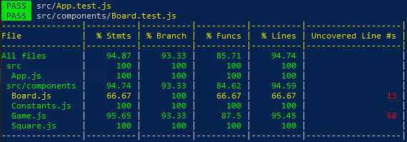
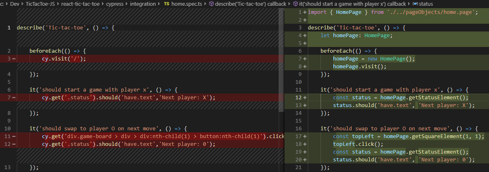
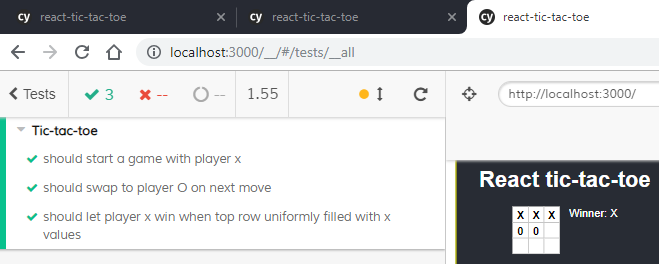

# React tic-tac-toe
The concept is based largely on the [tic-tac-toe tutorial](https://reactjs.org/tutorial/tutorial.html) published by react, however I have taken the same concepts and written tests with Jest and Enzyme for each scenario before I worked through the tutorial trying to understand react concepts.

Reacts tutorial is not great for TDD, adds a lot of design decisions upfront making it hard to TDD. My honest opinion is I would use that exercise to get familiar with React, but then I would delete it and start again. It is hard to retrofit some of the ideas into a TDD structure the way the current code is written, however I have kept it similar to the tutorial in order to keep the teaching aid similar but with the notion of testing in mind. I renamed certain things to make it more readable, altered the format slightly, used constants to explain the array positions. This is more for anyone wanting to practise testing with a familiar pattern, learning REACT and testing in the same space.

Once you have mastered this, feel free to go to the same tutorial link and try to do one of the other tutorials but doing it utilising TDD in a purer format.



This project was bootstrapped with [Create React App](https://github.com/facebook/create-react-app).

## How to start this

- Create empty react app

   ```powershell
   npx create-react-app react-tic-tac-toe
   ```
- Add Jest and enzyme testing framework (optional)

  ```powershell
  npm i --save-dev enzyme enzyme-adapter-react-16
  ```
- Jest cheatsheet can be found https://github.com/sapegin/jest-cheat-sheet
- Enzyme cheatsheet https://devhints.io/enzyme

## Outside in TDD
Testing tic-tac-toe through the original tutorial, *Game* was a small component with an overloaded board component containing the game logic. The board was essentially the starting point, if you follow the tutorial precisely, but after a final refactoring at the end of the tutorial, the *Game* looks like the starting point of everything. 

Starting simply I would have put most of the logic on the *Game* component, including the board logic and slowly refactor out abstractions or components when I thought the component was doing too much (SRP.) The domain board shouts out from the requiments but it can create unintentional complexity if done up front. The first test would have been based on the player X, who must go first based on the rules of the game. On the theme of players, I would work on toggling the players. See [Game test](src/components/Game.test.js) for more details. 

The next tests would help me focus on the board and the logical test positions. That would move me from the outside to the inside, which is the board. It is made up of three rows of squares, the square being responsible for showing three states, 0, X or a default empty state. So board would only be responsponsible for defining this matrix of squares and passing values back to the squares. See [Board test](src/components/Board.test.js) for more details. 

The square is only a visual button for displaying and invoking a click event to move the state from its default, if possible. See [Square test](src/components/Square.test.js) for more details.

Focusing on the board and the one simple test of defining the 9 squares was simple but effective. This immediatly placed focus on the square and the tests focused on passing a value to display and defining a click event notifying observers that something should occur. The next focus would then be on working out the winning status on all unified rows. The edge cases would be the final scenario, like not being able to click on a square that already had an event assigned and moving out. See [Game test scenarios](src/components/Game.test.scenarios.json). The scenario test strategey was important for making each scenario human readable, and hence the emphasis on the additional testing strategy discussed previously.

## Testing strategies

Created some overloaded tests using enzyme, react-test-renderer to show how you could test using the different ideas.  Some tests are duplicated to show you the advantage and disadvantages of doing either. Included Enzyme within this to show what can and can't be done with this, there seemed to be some negative information linked to the enzyme library, in that it had many git issues raised against it, promoted some bad testing practices. I presonally found it to be simpler to use than the react-test-renderer it wrapped, however I chose one or the other depending on what I needed to achieve and think you could do the same. 

1. A simple rule for unit tests, all external dependencies need to be mocked.
2. Unit Test only the component and not the child components, except for maybe doing a test to make sure they are referenced with the correct arguments. They should have their own tests so shallow rendering seems the most appropriate.
3. Integration tests can access external resources and need to be separated from the unit tests as they may be potentially slow, "expensive to run" and need to be be careful of side effects.
4. System tests or e2e tests should test a user journey through the application, simple interaction that runs through the entire vertical in a simplistic way.
5. Do not invert the test pyramid, and make sure unit tests are blazingly fast, test all edge cases, integration working through several components efficiently.

## Additional test strategy

I wanted to experiment with scenario based testing, so the JSON is formatted in such a way that each scenario is presented with an example, test data and a final expectation. The thing is I usually tweak with the *package.json* to allow me to import files, and then I reference them usually with some odd default format, but this was painless and easy to *npm* *install* the library and use it as required.



Start by importing the json file into the test class e.g..



The test code is based on iterating through the test scenarios structuring the scenarios data with whatever data parameters you want to pass in to the test. This is json data, so it is up to you how you want this to look. 



# Environment Details

## Available Scripts

In the project directory, you can run:

### `npm start`

Runs the app in the development mode.<br>
Open [http://localhost:3000](http://localhost:3000) to view it in the browser.

The page will reload if you make edits.<br>
You will also see any lint errors in the console.

### `npm test`

Launches the test runner in the interactive watch mode.<br>
See the section about [running tests](https://facebook.github.io/create-react-app/docs/running-tests) for more information.

### `npm run build`

Builds the app for production to the `build` folder.<br>
It correctly bundles React in production mode and optimizes the build for the best performance.

The build is minified and the filenames include the hashes.<br>
Your app is ready to be deployed!

See the section about [deployment](https://facebook.github.io/create-react-app/docs/deployment) for more information.

### `npm run eject`

**Note: this is a one-way operation. Once you `eject`, you can’t go back!**

If you aren’t satisfied with the build tool and configuration choices, you can `eject` at any time. This command will remove the single build dependency from your project.

Instead, it will copy all the configuration files and the transitive dependencies (Webpack, Babel, ESLint, etc) right into your project so you have full control over them. All of the commands except `eject` will still work, but they will point to the copied scripts so you can tweak them. At this point you’re on your own.

You don’t have to ever use `eject`. The curated feature set is suitable for small and middle deployments, and you shouldn’t feel obligated to use this feature. However we understand that this tool wouldn’t be useful if you couldn’t customize it when you are ready for it.

### `npm run coverage`

**Note: this is a custom added action, to make running code coverage easier**

The threshold is configured within the *packages.json* file, along with any file/folder exclusions or custom jest overrides, see "jest" attribute for more information. running this will output summary information and highlight any files that that may have bad code coverage.



### `npm run cypress:open`

**Note: this is a custom added action, to make running e2e tests easier**

Configured Cypress to do e2e testing. Used *typescript* for investigating how well this would work, so you will probably need to install typescript globally in your local environment for this to run successfully.

```powershell
npm install -g typescript
```

When tackling the e2e test, initially I create the simple logic of working out what needs to be done using the cypress library. After refactor the objects into a *PageObject* to remove repetition or to make the actual methods more descriptive.



The test runner is intuitive, displaying failed and passed tests on the left as well as the running of the application on the right.



## Learn More

You can learn more in the [Create React App documentation](https://facebook.github.io/create-react-app/docs/getting-started).

To learn React, check out the [React documentation](https://reactjs.org/).

### Code Splitting

This section has moved here: https://facebook.github.io/create-react-app/docs/code-splitting

### Analyzing the Bundle Size

This section has moved here: https://facebook.github.io/create-react-app/docs/analyzing-the-bundle-size

### Making a Progressive Web App

This section has moved here: https://facebook.github.io/create-react-app/docs/making-a-progressive-web-app

### Advanced Configuration

This section has moved here: https://facebook.github.io/create-react-app/docs/advanced-configuration

### Deployment

This section has moved here: https://facebook.github.io/create-react-app/docs/deployment

### `npm run build` fails to minify

This section has moved here: https://facebook.github.io/create-react-app/docs/troubleshooting#npm-run-build-fails-to-minify
